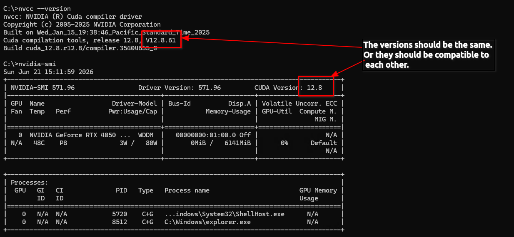

## Issue: `ggml_cuda_init:failed_to_initialize_CUDA_null`

I encountered this issue after successfully installing and compiling. The error was reported in the CLI logs upon execution.

**Cause:**
The root cause was an incompatibility between the CUDA toolkit version and the installed driver version:
*   **CUDA Toolkit:** 13.3
*   **Video Driver:** 12.8

**Resolution:**
To resolve this, I decided to use the CUDA toolkit version 12.8.

**Visual Reference:**

