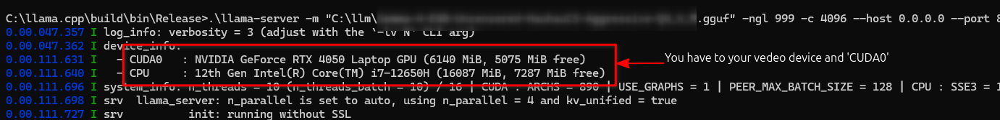
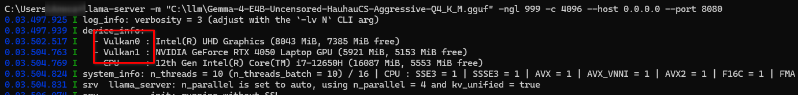

# Running the Llama Server

Before running, navigate to the directory containing `llama-server`:
- **Windows:** `C:\llama.cpp\build\bin\Release`

**Execution Command:**
Execute the server using the following command. Adjust the parameters (`path_to_model.gguf`, `ngl`, `c`, `host`, and `port`) as necessary:

\`\`\`bash
./llama-server -m path_to_model.gguf -ngl 999 -c 4096 --host 0.0.0.0 --port 8080
\`\`\`

**Expected Output:**
Upon successful execution, you should see the server initializing and loading the model onto your video card (CUDA0).

*Figure 1: Confirmation of Llama Server running successfully and loading the model onto CUDA0.*

**!!!***
If you compiled with the flags `-DLLAMA_CUDA=ON -DGGML_VULKAN=OFF` or simply with `-DLLAMA_CUDA=ON` and observe:

this indicates that llama.cpp is **not** utilizing CUDA, and is instead using Vulkan.
